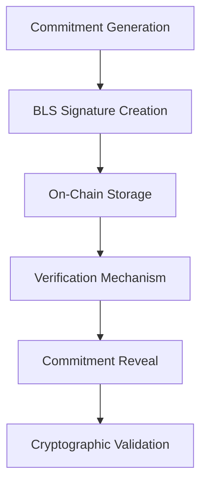
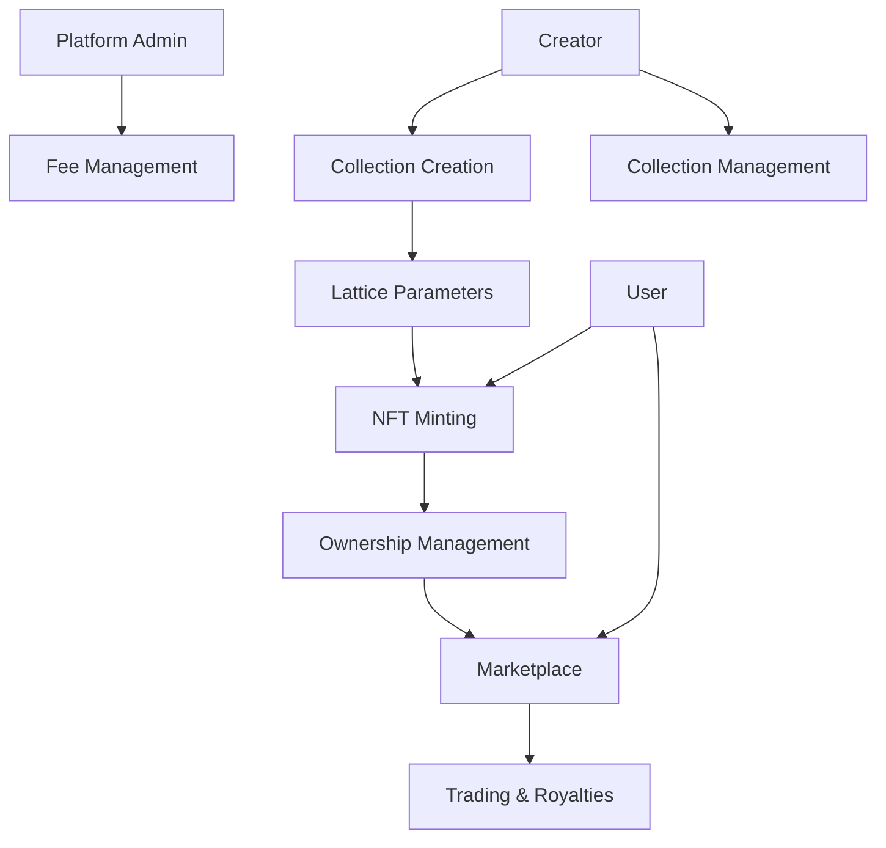

# # BLS Commitment Protocol

A cryptographically secure smart contract platform implementing Boneh-Lynn-Shacham (BLS) signature-based commitment mechanisms on the Stacks blockchain.

## Overview

The BLS Commitment Protocol provides a robust, verifiable, and privacy-preserving commitment scheme leveraging the mathematical properties of BLS signatures. This implementation enables secure, non-interactive commitments that can be used in various decentralized applications requiring advanced cryptographic primitives.

### Key Features
- Cryptographically secure commitment mechanism
- Non-interactive verification
- Minimal on-chain storage requirements
- Flexible commitment construction
- Support for complex validation scenarios

## Architecture



## Contract Documentation

### Core Contract: bls-commitment.clar

#### Purpose
Implements a flexible BLS signature-based commitment protocol with secure verification and reveal mechanisms.

#### Key Components
1. **Commitment Management**: Handles commitment generation and storage
2. **Verification Mechanisms**: Enables cryptographic validation
3. **Reveal Protocol**: Supports secure commitment revelation
4. **Access Controls**: Manages commitment lifecycle

## Getting Started

### Prerequisites
- Clarinet
- Stacks wallet
- Basic understanding of cryptographic commitments

### Usage Examples

1. Create a Commitment:
```clarity
(contract-call? .bls-commitment create-commitment 
    commitment-hash 
    extra-data
)
```

2. Verify Commitment:
```clarity
(contract-call? .bls-commitment verify-commitment 
    commitment-hash 
    proof
)
```

## Development

### Testing
```bash
clarinet test
clarinet check
```

### Deployment
```bash
clarinet deploy --testnet
clarinet deploy --mainnet
```

## Security Considerations

### Cryptographic Guarantees
- Commitment privacy
- Non-malleability
- Verifiable revelation

### Best Practices
1. Use unique commitment generation
2. Protect private reveal data
3. Validate all incoming proofs
4. Implement appropriate access controls

## Research & Inspiration
- Boneh-Lynn-Shacham Signatures
- Cryptographic Commitment Schemes
- Verifiable Delay Functions

## License
MIT License

A specialized NFT platform enabling the creation, minting, and trading of mathematically-generated lattice structure artworks on the Stacks blockchain.

## Overview

LatticeMint is an innovative NFT platform that combines mathematical precision with digital art. It allows creators to generate unique NFTs based on deterministic lattice structures, where each piece's uniqueness is guaranteed through a combination of mathematical parameters and seed values stored on-chain.

### Key Features
- Create collections with customizable lattice parameters
- Mint NFTs with verifiable uniqueness
- Built-in marketplace functionality
- Creator royalties support
- Mathematical parameter storage for each collection
- Client-side rendering based on on-chain parameters

## Architecture

The platform is built around a single core smart contract that manages all aspects of the NFT ecosystem, from collection creation to marketplace operations.



## Contract Documentation

### Core Contract: lattice-mint.clar

#### Purpose
Manages the entire lifecycle of lattice-based NFTs, including collection creation, minting, trading, and marketplace functionality.

#### Key Components
1. **Collections**: Stores collection metadata and minting parameters
2. **Lattice Parameters**: Defines the mathematical properties of each collection
3. **NFTs**: Manages individual token ownership and metadata
4. **Marketplace**: Handles listings and sales
5. **Royalties**: Automated royalty distribution system

## Getting Started

### Prerequisites
- Clarinet installed
- Stacks wallet for deployment/interaction

### Usage Examples

1. Create a Collection:
```clarity
(contract-call? .lattice-mint create-collection 
    "My Lattice Art"
    "A collection of geometric patterns"
    u100 ;; max supply
    u10000000 ;; mint price (10 STX)
    u250 ;; royalty (2.5%)
    "ipfs://..." ;; metadata URI
    u2 ;; dimensions
    u16 ;; nodes
    ;; ... other parameters
)
```

2. Mint an NFT:
```clarity
(contract-call? .lattice-mint mint-nft u1 u12345678)
```

3. List NFT for Sale:
```clarity
(contract-call? .lattice-mint list-nft-for-sale u1 u1 u20000000)
```

## Function Reference

### Collection Management
- `create-collection`: Create a new lattice collection
- `set-collection-status`: Toggle minting status
- `get-collection`: Read collection details

### NFT Operations
- `mint-nft`: Mint a new NFT
- `transfer-nft`: Transfer NFT to another address
- `get-nft`: Get NFT details
- `get-nft-owner`: Get current owner

### Marketplace
- `list-nft-for-sale`: List NFT on marketplace
- `cancel-listing`: Remove marketplace listing
- `buy-nft`: Purchase listed NFT

### Administrative
- `set-platform-fee`: Update platform fee percentage
- `set-contract-admin`: Transfer admin rights

## Development

### Local Testing
```bash
# Run local tests
clarinet test

# Check contract
clarinet check
```

### Deployment
```bash
# Deploy to testnet
clarinet deploy --testnet

# Deploy to mainnet
clarinet deploy --mainnet
```

## Security Considerations

### Limitations
- Maximum royalty rate of 30%
- Maximum platform fee of 10%
- Collection size must be greater than 0
- Minimum of 2 nodes per lattice

### Best Practices
1. Always verify transaction status
2. Check NFT ownership before operations
3. Ensure sufficient STX balance for purchases
4. Validate collection parameters before minting
5. Monitor listing prices for accuracy

### Data Privacy
- Seed values and parameters are public on-chain
- Consider using IPFS or similar for storing detailed metadata
- Client-side rendering keeps computational load off-chain